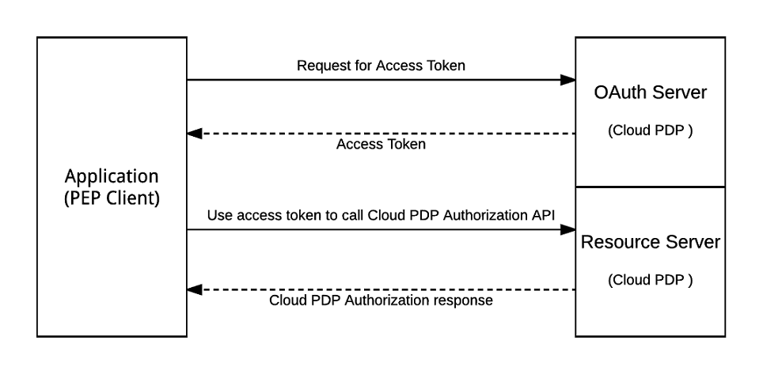

# NextLabs PDP REST API Interface

## Introduction

---

This document explains how to send a standard XACML request to the NextLabs Cloud PDP (Policy Decision Point) REST API and get a response. For additional details and examples, refer to the REST API section of the CloudAz.

## Accessing the Cloud PDP REST API

## Authentication
---
The Cloud PDP REST API uses the OAuth 2.0 protocol for authentication. To use the REST API, you must obtain OAuth 2.0 client credentials from the Cloud PDP OAuth server. Your client application then requests an access token from the Cloud PDP Server, extracts the token from the response, and sends the token along with the request to the Cloud PDP Authorization API. Your client OAuth 2.0 credentials are generally shared in the welcome email from NextLabs.



### Request for Access Token

CloudAz supports OAuth2 [Client Credentials Grant](https://tools.ietf.org/html/rfc6749#section-4.4).

#### Access Token Request Endpoint

The endpoint used to make an an access an token request is : `https://<CloudAz REST Host>/oauth/token`

#### Access Token Request

The client application makes a request to the token endpoint by adding the following parameters using "application/x-www-form-urlencoded" with a character encoding of UTF-8 in the HTTP request entity-body:

* `grant_type` REQUIRED. The value MUST be set to "client_credentials".
* `client_id` REQUIRED.  The API Client ID
* `client_secret` REQUIRED.  The API Client Secret.
* `expires_in` OPTIONAL. If specified, the token returned expires in the seconds specified. Users can request tokens that are valid for a maximum of one year, which is 3600 * 24 * 365 seconds. If this parameter is omitted, the default value, 3600, is used.

An example of the request:

```
POST /oauth/token HTTP/1.1
Host: server.example.com
Content-Type: application/x-www-form-urlencoded

grant_type=client_credentials&client_id=apiclient&client_secret=ABCDEFGABCDEFG
```

#### Access Token Response

If the access token request is valid and authorized, the OAuth Server issues an access token.

An example of the response:

```
HTTP/1.1 200 OK
{
    "access_token":"2YotnFZFEjr1zCsicMWpAA",
    "token_type":"Bearer",
    "expires_in":3600,
}
```

## Sending a Simple XACML Evaluation Request

---

Once an access token has been obtained, the client application can call the Cloud PDP XACML evaluation API using these guidelines : 
 * REST client : Any standard REST client, such as Postman or ARC (Advanced Rest Client) can send requests to Cloud PDP Rest API
 *  HTTP Method : **`POST`**
 * Request URI or REST end point : **`https:/<Cloud Az PDP Host>/dpc/authorization/pdp`**


### REST Request

Header Key |  Header Value  | Description
---|-----|---
Content-Type | **application/json** or **application/xml** | Mandatory parameter used to identify the request data type; supports only **application/json** or **application/xml**
Service | EVAL | The type of service requested
Version | 1.0  | The API version
Authorization| Bearer <access_token> | The access token obtained from OAuth2 Access Token Request |

**XACML** based JSON or XML request data must be sent in the HTTP body. Please refer to the sample below for further details.


### Parameterized POST Request

Parameter Key |  Parameter Value  | Description
---|-----|---
DataType | **xml** or **json** | The Data Type of the request (XML or JSON)
Service | EVAL | The type of service requested
Version | 1.0 | The API Version
data | XACML request payload. Please refer to the sample shown below for further details | The request data sent for    evaluation, in XML or JSON format

Header Key |  Header Value  | Description
---|-----|---
Authorization| Bearer <access_token> | The access token obtained from the OAuth2 Access Token Request |

#### Sample JSON Request

```json
{
  "Request":{
    "ReturnPolicyIdList":"true",
    "Category":[
      {
        "CategoryId":"urn:oasis:names:tc:xacml:1.0:subject-category:access-subject",
        "Attribute":[
          {
            "AttributeId":"urn:oasis:names:tc:xacml:1.0:subject:subject-id",
            "Value":"chris.weber@hdesk.com",
            "IncludeInResult":"false"
          },
          {
            "AttributeId":"urn:oasis:names:tc:xacml:1.0:subject:assigned_prod_area",
            "Value":"Exchange Email",
            "IncludeInResult":"false"
          },
          {
            "AttributeId":"urn:oasis:names:tc:xacml:1.0:subject:department",
            "Value":"IT",
            "IncludeInResult":"false"
          }
        ]
      },
      {
        "CategoryId":"urn:oasis:names:tc:xacml:3.0:attribute-category:resource",
        "Attribute":[
          {
            "DataType":"http://www.w3.org/2001/XMLSchema#anyURI",
            "AttributeId":"urn:oasis:names:tc:xacml:1.0:resource:resource-id",
            "Value":"Ticket:1103",
            "IncludeInResult":"false"
          },
          {
            "DataType":"http://www.w3.org/2001/XMLSchema#anyURI",
            "AttributeId":"urn:nextlabs:names:evalsvc:1.0:resource:resource-type",
            "Value":"support_tickets",
            "IncludeInResult":"false"
          },
          {
            "DataType":"http://www.w3.org/2001/XMLSchema#anyURI",
            "AttributeId":"urn:oasis:names:tc:xacml:1.0:resource:prod_name",
            "Value":"Exchange Email",
            "IncludeInResult":"false"
          }
        ]
      },
      {
        "CategoryId":"urn:oasis:names:tc:xacml:3.0:attribute-category:action",
        "Attribute":[
          {
            "DataType":"http://www.w3.org/2001/XMLSchema#string",
            "AttributeId":"urn:oasis:names:tc:xacml:1.0:action:action-id",
            "Value":"EDIT_TKTS",
            "IncludeInResult":"false"
          }
        ]
      },
      {
        "CategoryId":"urn:nextlabs:names:evalsvc:1.0:attribute-category:application",
        "Attribute":[
          {
            "DataType":"http://www.w3.org/2001/XMLSchema#string",
            "AttributeId":"urn:nextlabs:names:evalsvc:1.0:application:application-id",
            "Value":"Helpdesk",
            "IncludeInResult":"false"
          }
        ]
      },
      {
        "CategoryId":"urn:oasis:names:tc:xacml:3.0:attribute-category:environment",
        "Attribute":[
          {
            "DataType":"http://www.w3.org/2001/XMLSchema#dateTime",
            "AttributeId":"urn:oasis:names:tc:xacml:1.0:environment:authentication_type",
            "Value":"multifactor",
            "IncludeInResult":"false"
          }
        ]
      }
    ]
  }
}
```

#### JSON Response

The response contains the result of the single request evaluation. The result has the decision, status and list of obligations for the authorization request.

```json
{
  "Response": {
    "Result": [{
      "Decision": "Permit",
      "Status": {
        "StatusMessage": "success",
        "StatusCode": {
          "Value": "urn:oasis:names:tc:xacml:1.0:status:ok"
        }
      },
      "Obligations": []
    }]
  }
}
```

#### Sample XML Request


```xml
<?xml version="1.0" encoding="UTF-8"?>
<Request xmlns="urn:oasis:names:tc:xacml:3.0:core:schema:wd-17" xmlns:xsi="http://www.w3.org/2001/XMLSchema-instance" xsi:schemaLocation="urn:oasis:names:tc:xacml:3.0:core:schema:wd-17 http://docs.oasis-open.org/xacml/3.0/xacml-core-v3-schema-wd-17.xsd" ReturnPolicyIdList="false">
   <Attributes Category="urn:oasis:names:tc:xacml:1.0:subject-category:access-subject">
      <Attribute IncludeInResult="false" AttributeId="urn:oasis:names:tc:xacml:1.0:subject:subject-id">
         <AttributeValue DataType="http://www.w3.org/2001/XMLSchema#string">chris.weber@hdesk.com</AttributeValue>
      </Attribute>
      <Attribute IncludeInResult="false" AttributeId="urn:oasis:names:tc:xacml:1.0:subject:department">
         <AttributeValue DataType="http://www.w3.org/2001/XMLSchema#string">IT</AttributeValue>
      </Attribute>
   </Attributes>
   <Attributes Category="urn:oasis:names:tc:xacml:3.0:attribute-category:resource">
      <Attribute IncludeInResult="false" AttributeId="urn:oasis:names:tc:xacml:1.0:resource:resource-id">
         <AttributeValue DataType="http://www.w3.org/2001/XMLSchema#String">Ticket:1103</AttributeValue>
      </Attribute>
      <Attribute IncludeInResult="false" AttributeId="urn:nextlabs:names:evalsvc:1.0:resource:resource-type">
         <AttributeValue DataType="http://www.w3.org/2001/XMLSchema#String">support_tickets</AttributeValue>
      </Attribute>
   </Attributes>
   <Attributes Category="urn:oasis:names:tc:xacml:3.0:attribute-category:action">
      <Attribute IncludeInResult="false" AttributeId="urn:oasis:names:tc:xacml:1.0:action:action-id">
         <AttributeValue DataType="http://www.w3.org/2001/XMLSchema#string">VIEW_TKTS</AttributeValue>
      </Attribute>
   </Attributes>
   <Attributes Category="urn:nextlabs:names:evalsvc:1.0:attribute-category:application">
      <Attribute IncludeInResult="false" AttributeId="urn:nextlabs:names:evalsvc:1.0:application:application-id">
         <AttributeValue DataType="http://www.w3.org/2001/XMLSchema#String">Helpdesk</AttributeValue>
      </Attribute>
   </Attributes>
   <Attributes Category="urn:oasis:names:tc:xacml:3.0:attribute-category:environment">
      <Attribute AttributeId="authentication_type" Issuer="" IncludeInResult="false">
         <AttributeValue DataType="http://www.w3.org/2001/XMLSchema#string">multifactor</AttributeValue>
      </Attribute>
   </Attributes>
</Request>
```

#### XML Response

```xml
<?xml version="1.0" encoding="UTF-8" standalone="yes"?>
<Response xmlns="urn:oasis:names:tc:xacml:3.0:core:schema:wd-17">
    <Result>
        <Decision>Permit</Decision>
        <Status>
            <StatusCode Value="urn:oasis:names:tc:xacml:1.0:status:ok"/>
            <StatusMessage>success</StatusMessage>
        </Status>
        <Obligations/>
    </Result>
</Response>
```

### Additional Details

---

* **XACML Support**
  NextLabs Cloud PDP REST API is based on the XACML REST profile, and it supports requests and responses in both XML and JSON format. Each request is composed of categories that must include Subject, Resource, Action and Application. If one of these required categories in missing, the request is invalid.

#### Standard XACML Request Categories

* **Subject**
  * **Category Id** : `urn:oasis:names:tc:xacml:1.0:subject-category:access-subject`
  * **Attribute Prefix** : `urn:oasis:names:tc:xacml:1.0:subject:<subject-attribute-id>`
  * `subject-id` or `name` is mandatory, all other attributes are optional.

* **Resource**
  * **Category Id** : `urn:oasis:names:tc:xacml:3.0:attribute-category:resource`
  * **Attribute Prefix** : `urn:oasis:names:tc:xacml:1.0:resource:_<resource-attribute-id>`
  * `resource-id` is a mandatory attribute.  If it is not specified, the request is invalid.
  * `urn:nextlabs:names:evalsvc:1.0:resource:resource-type` is a mandatory attribute. This is used to identify the NextLab specific resource type or policy model type. The value of resource-type should be equal to the short_name of the Resource Type selected during resource component creation.
  * `urn:nextlabs:names:evalsvc:1.0:resource:resource-dimension` is another NextLabs specific attribute. It has two permissible values, `to` and `from`. A resource with the dimension `from` represents the source,  and a resource with the dimesnsion `to` represents the destination. If no dimension is specified, `from` is assigned by default. The destination cannot be specified without a source, so if a resource with only `to` dimension is specified, the request is invalid and an appropriate message is displayed to the user. Similarly if an invalid dimension (apart from "to" or "from") is specified, the request is invalid.
  * Another important resource attribute is `nocache`. If its value is specified as `yes`, as in the example below, the Cloud PDP does not cache its attributes.

* **Action**
  * **Category Id** : `urn:oasis:names:tc:xacml:3.0:attribute-category:action`
  * **Attribute Prefix** : `urn:oasis:names:tc:xacml:1.0:action:action-id`
  * `action-id` is the only permissible attribute here

#### NextLabs Specific Request Categories

* **Application**
  * **Category Id** : `urn:nextlabs:names:evalsvc:1.0:attribute-category:application`
  * **Attribute Prefix** :  `urn:nextlabs:names:evalsvc:1.0:application:<application-attribute-id>`


